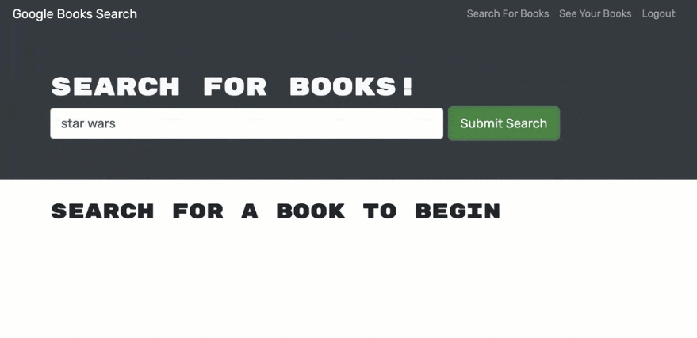

# book-search-engine
  by allstarcoding777
  
  * ## Description
  This application is a Google Books API. The Google Books API allows your application to perform full-text searches and retrieve book information, viewability, and eBook availability.
  * ## Usage
  A user can search for new books to read and can keep a list of books to purchase.

  
  
  
  * ## Github Repository
  https://github.com/allstarcoding777/book-search-engine
  * ## License
  This project is licensed under the MIT license.